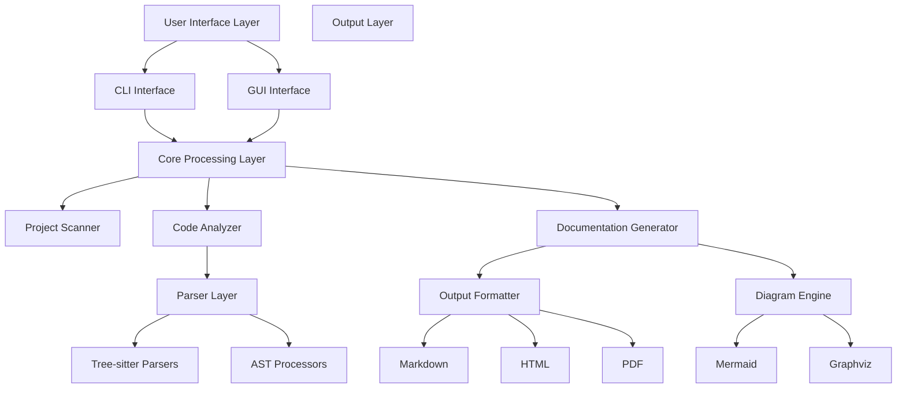

# Design Document: Codebase Documentation Generator

## Overview

The Codebase Documentation Generator is a Python application that automatically analyzes local codebases and generates comprehensive documentation. The system employs a modular architecture with pluggable parsers for different programming languages, leveraging Tree-sitter for robust code parsing and multiple output formats for documentation generation.

The application supports both CLI and GUI interfaces, allowing users to analyze codebases through their preferred interaction method. The core analysis engine processes source code files to extract structural information, identify architectural patterns, and generate multiple types of documentation including project overviews, design specifications, visual diagrams, and code understanding summaries.

## Architecture

The system follows a layered architecture with clear separation of concerns:



### Key Architectural Decisions

1. **Tree-sitter for Parsing**: Based on research, Tree-sitter provides robust, incremental parsing with excellent multi-language support and is actively maintained with Python bindings.

2. **Plugin Architecture**: Language-specific parsers are implemented as plugins, allowing easy extension for new programming languages.

3. **Separation of Analysis and Generation**: Clear separation between code analysis (extracting information) and documentation generation (formatting output) enables flexible output formats.

4. **Dual Interface Support**: Both CLI and GUI interfaces share the same core processing engine, ensuring consistent functionality across interaction methods.

## Components and Interfaces

### Core Components

#### Project Scanner
```python
class ProjectScanner:
    def scan_directory(self, path: Path) -> ProjectStructure:
        """Recursively scan directory and categorize files"""
        
    def detect_project_type(self, structure: ProjectStructure) -> ProjectType:
        """Identify project type and main programming languages"""
        
    def filter_files(self, files: List[Path], patterns: List[str]) -> List[Path]:
        """Apply inclusion/exclusion patterns"""
```

#### Code Analyzer
```python
class CodeAnalyzer:
    def __init__(self, parsers: Dict[str, LanguageParser]):
        self.parsers = parsers
        
    def analyze_codebase(self, structure: ProjectStructure) -> AnalysisResult:
        """Coordinate analysis across all files"""
        
    def extract_dependencies(self, files: List[ParsedFile]) -> DependencyGraph:
        """Build dependency relationships between components"""
```

#### Language Parser Interface
```python
class LanguageParser(ABC):
    @abstractmethod
    def parse_file(self, file_path: Path) -> ParsedFile:
        """Parse individual source file"""
        
    @abstractmethod
    def extract_symbols(self, parsed: ParsedFile) -> List[Symbol]:
        """Extract classes, functions, variables"""
        
    @abstractmethod
    def get_dependencies(self, parsed: ParsedFile) -> List[Dependency]:
        """Extract import/include relationships"""
```

#### Documentation Generator
```python
class DocumentationGenerator:
    def generate_project_overview(self, analysis: AnalysisResult) -> Document:
        """Create high-level project documentation"""
        
    def generate_design_specs(self, analysis: AnalysisResult) -> Document:
        """Document architectural patterns and design decisions"""
        
    def generate_code_summaries(self, analysis: AnalysisResult) -> Document:
        """Create detailed code explanations"""
```

#### Diagram Engine
```python
class DiagramEngine:
    def create_architecture_diagram(self, analysis: AnalysisResult) -> Diagram:
        """Generate system architecture visualization"""
        
    def create_flow_diagram(self, analysis: AnalysisResult) -> Diagram:
        """Generate execution flow visualization"""
        
    def render_diagram(self, diagram: Diagram, format: DiagramFormat) -> bytes:
        """Render diagram in specified format"""
```

### Interface Components

#### CLI Interface
```python
class CLIInterface:
    def parse_arguments(self) -> CLIConfig:
        """Parse command line arguments using argparse"""
        
    def run_analysis(self, config: CLIConfig) -> None:
        """Execute analysis with progress reporting"""
        
    def display_results(self, results: GenerationResult) -> None:
        """Show completion summary and output locations"""
```

#### GUI Interface
```python
class GUIInterface:
    def __init__(self):
        """Initialize GUI using tkinter for cross-platform compatibility"""
        
    def setup_main_window(self) -> None:
        """Create main application window with file browser"""
        
    def show_progress(self, progress: ProgressInfo) -> None:
        """Display real-time progress updates"""
        
    def display_results(self, results: GenerationResult) -> None:
        """Show results with options to view generated documentation"""
```

## Data Models

### Core Data Structures

```python
@dataclass
class ProjectStructure:
    root_path: Path
    files: List[Path]
    languages: Dict[str, int]  # language -> file count
    project_type: ProjectType
    entry_points: List[Path]

@dataclass
class ParsedFile:
    path: Path
    language: str
    ast: Any  # Tree-sitter node or AST
    symbols: List[Symbol]
    dependencies: List[Dependency]
    complexity_metrics: ComplexityMetrics

@dataclass
class Symbol:
    name: str
    type: SymbolType  # CLASS, FUNCTION, VARIABLE, etc.
    location: Location
    signature: Optional[str]
    docstring: Optional[str]
    visibility: Visibility

@dataclass
class Dependency:
    source: str
    target: str
    type: DependencyType  # IMPORT, INHERITANCE, CALL, etc.
    location: Location

@dataclass
class AnalysisResult:
    project: ProjectStructure
    files: List[ParsedFile]
    dependency_graph: DependencyGraph
    architectural_patterns: List[ArchitecturalPattern]
    complexity_summary: ComplexitySummary

@dataclass
class Document:
    title: str
    content: str
    format: DocumentFormat
    metadata: Dict[str, Any]
    cross_references: List[CrossReference]

@dataclass
class Diagram:
    title: str
    type: DiagramType
    content: str  # Mermaid syntax or DOT notation
    metadata: Dict[str, Any]
```

### Configuration Models

```python
@dataclass
class AnalysisConfig:
    include_patterns: List[str]
    exclude_patterns: List[str]
    max_file_size: int
    languages: List[str]
    analysis_depth: AnalysisDepth

@dataclass
class OutputConfig:
    output_directory: Path
    formats: List[DocumentFormat]
    diagram_formats: List[DiagramFormat]
    template_directory: Optional[Path]
    custom_styles: Optional[Path]
```

## Correctness Properties

*A property is a characteristic or behavior that should hold true across all valid executions of a system-essentially, a formal statement about what the system should do. Properties serve as the bridge between human-readable specifications and machine-verifiable correctness guarantees.*

Before defining the correctness properties, I need to analyze the acceptance criteria from the requirements to determine which are testable as properties.

### Property Reflection

After analyzing all acceptance criteria, I identified several areas where properties can be consolidated to eliminate redundancy:

- Error handling properties (1.4, 2.5, 3.4, 4.5, 8.1-8.5) can be combined into comprehensive error handling properties
- Format support properties (2.4, 3.3) can be unified into a single format support property
- Configuration properties (7.1-7.5) can be consolidated into configuration handling properties
- Multi-language properties (4.1-4.3) can be combined for comprehensive language support testing

### Core Properties

**Property 1: Recursive Directory Analysis**
*For any* valid directory path, the analyzer should successfully scan all files recursively and correctly identify the programming language of each discoverable source file
**Validates: Requirements 1.1, 1.5**

**Property 2: Structural Information Extraction**
*For any* source code file in a supported language, the parser should extract all structural elements (classes, functions, modules, dependencies) that exist in the file
**Validates: Requirements 1.2, 1.3**

**Property 3: Multi-language Project Processing**
*For any* project containing multiple programming languages, the analyzer should process each language appropriately while maintaining consistent output structure and creating unified documentation
**Validates: Requirements 4.1, 4.2, 4.3, 4.4**

**Property 4: Documentation Generation Completeness**
*For any* completed analysis result, the generator should create all requested documentation types (project overview, design specs, code summaries) with all required sections present
**Validates: Requirements 2.1, 2.2, 2.3**

**Property 5: Diagram Generation Consistency**
*For any* analyzed codebase, the diagram engine should generate both flow and architecture diagrams that accurately represent the code structure and relationships
**Validates: Requirements 3.1, 3.2, 3.5**

**Property 6: Format Support Universality**
*For any* generated documentation or diagram content, the output formatter should be able to render it in all supported formats (Markdown, HTML, PDF for docs; SVG, PNG, Mermaid for diagrams)
**Validates: Requirements 2.4, 3.3**

**Property 7: Output Organization Consistency**
*For any* documentation generation run, the output formatter should create a logically structured directory hierarchy with index files, metadata, cross-references, and proper conflict handling
**Validates: Requirements 6.1, 6.2, 6.3, 6.4, 6.5**

**Property 8: Configuration Respect**
*For any* valid configuration settings (inclusion/exclusion patterns, custom templates, output formats, styling), the system should apply these settings correctly throughout the analysis and generation process
**Validates: Requirements 7.1, 7.2, 7.3, 7.4, 7.5**

**Property 9: Interface Validation and Feedback**
*For any* user input (directory paths, configuration options), the interface manager should validate the input and provide appropriate feedback, progress indicators, and results summaries
**Validates: Requirements 5.1, 5.2, 5.3, 5.4, 5.5**

**Property 10: Comprehensive Error Handling**
*For any* error condition (unreadable files, parsing failures, permission issues, invalid configurations, critical errors), the system should handle the error gracefully, provide detailed error information, continue processing where possible, and offer recovery options
**Validates: Requirements 1.4, 2.5, 3.4, 4.5, 8.1, 8.2, 8.3, 8.4, 8.5**

## Error Handling

The system implements comprehensive error handling at multiple levels:

### File-Level Error Handling
- **Unreadable Files**: Skip with warning, continue processing
- **Permission Errors**: Clear error messages with suggested solutions
- **Corrupted Files**: Log detailed error information, attempt recovery

### Parser-Level Error Handling
- **Syntax Errors**: Detailed error reporting with file location
- **Unsupported Language**: Fallback to generic text analysis
- **Memory Issues**: Graceful degradation with partial results

### Generation-Level Error Handling
- **Template Errors**: Fallback to default templates
- **Format Conversion Failures**: Provide alternative formats
- **Diagram Rendering Issues**: Text-based fallback representations

### System-Level Error Handling
- **Critical Failures**: Save partial results, provide recovery options
- **Configuration Errors**: Validation with meaningful error messages
- **Resource Exhaustion**: Progressive quality reduction to complete processing

## Testing Strategy

The testing strategy employs a dual approach combining unit tests for specific scenarios and property-based tests for comprehensive coverage:

### Property-Based Testing
- **Minimum 100 iterations** per property test to ensure thorough coverage
- **Random input generation** for directory structures, source files, and configurations
- **Cross-language testing** with generated code samples in multiple languages
- **Error injection testing** to verify robust error handling
- **Configuration fuzzing** to test various configuration combinations

### Unit Testing Focus Areas
- **Language-specific parser edge cases** for each supported programming language
- **Template rendering edge cases** with malformed or missing templates
- **File system integration** with various permission scenarios
- **GUI component behavior** for user interface interactions
- **CLI argument parsing** with various command-line combinations

### Integration Testing
- **End-to-end workflows** from directory input to documentation output
- **Multi-format output validation** ensuring consistency across formats
- **Large codebase performance** testing with real-world projects
- **Cross-platform compatibility** testing on Windows, macOS, and Linux

### Property Test Configuration
Each property test will be configured with:
- **100+ iterations** for statistical confidence
- **Structured random input generation** using appropriate generators
- **Clear failure reporting** with minimal failing examples
- **Tag format**: **Feature: codebase-documentation-generator, Property {number}: {property_text}**

The combination of property-based and unit testing ensures both broad coverage of input spaces and detailed validation of specific edge cases, providing confidence in the system's correctness and robustness.